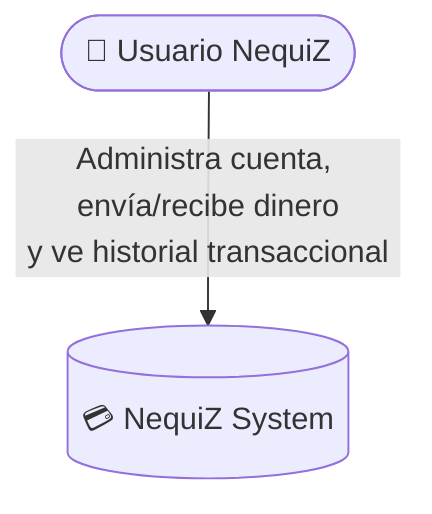
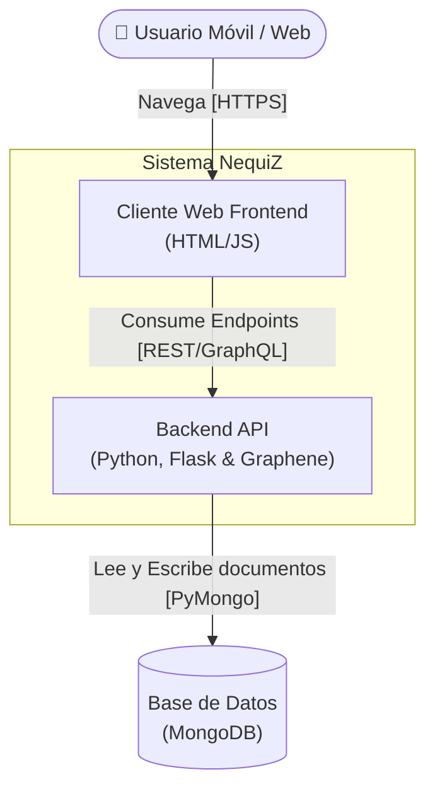
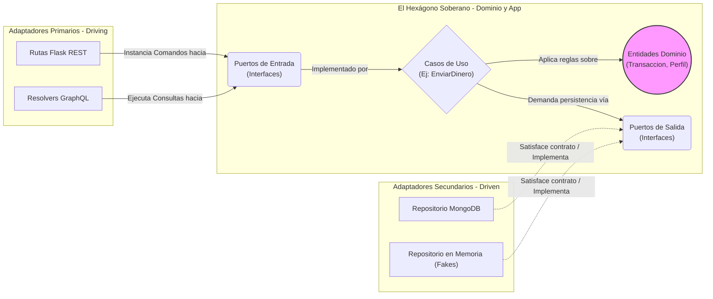
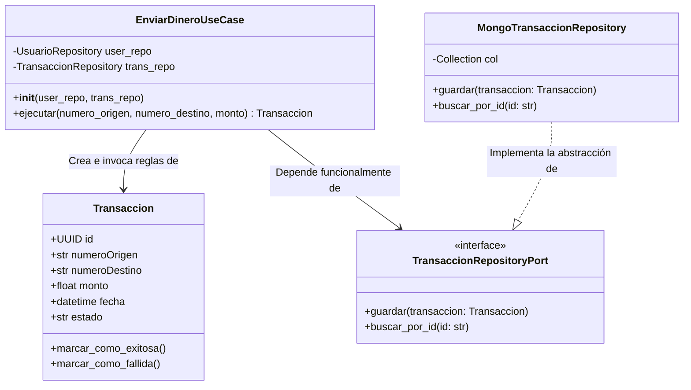

# NequiZ - Refactorización de Monolito a Arquitectura Hexagonal

* **Institución:** Escuela Tecnológica Instituto Técnico Central
* **Programa:** Ingeniería de Sistemas - Bogotá D.C. 2026
* **Instructor:** Ing. Germán González Rozo

**Equipo de Desarrollo:**
* Andrés Felipe Gerena Contreras
* Fabian Estevan Suarez Estupiñán
* Laura Camila Mosquera González

---

## 📖 Introducción y Contexto del Sistema Actual
"NequiZ" es una aplicación de billetera digital que permite realizar transferencias P2P, visualizar movimientos y gestionar un perfil de usuario. Actualmente, el sistema está construido bajo un enfoque monolítico utilizando Python con el framework Flask, implementando una exposición dual a través de una API REST y GraphQL, con persistencia de datos en MongoDB y seguridad basada en JSON Web Tokens (JWT).

El objetivo de este proyecto es rediseñar el sistema basándose en la Arquitectura Hexagonal (Puertos y Adaptadores) para aislar la lógica de negocio de las dependencias tecnológicas e infraestructurales.

## 🚩 Fase 1: Análisis del Monolito y Mapa de Deuda Técnica

### Análisis de Dependencias Actuales
La arquitectura original presenta un flujo de control bidireccional y fuertemente acoplado donde las capas de exposición actúan como orquestadores y conectores directos a la base de datos:
* **Presentación/Transporte:** Archivos como `app.py` y `queries.py` reciben las solicitudes HTTP o queries de GraphQL.
* **Procesamiento Híbrido:** Extraen el contexto de red (headers, tokens), aplican reglas de negocio y formatean respuestas.
* **Persistencia Directa:** Importan directamente colecciones de MongoDB (`usuarios_collection`, `transacciones_collection` desde `utils.db`).

### Violaciones Arquitectónicas Identificadas
Durante la Fase 1, se documentaron las siguientes vulnerabilidades críticas en el diseño actual:

1. **Acoplamiento de Transporte e Infraestructura:** En `graphql_schema/queries.py` (líneas 20-30), el resolver de GraphQL ejecuta directamente `transacciones_collection.find({...})`. Un adaptador de entrada habla directamente con uno de salida, impidiendo migrar de MongoDB a otra base de datos sin reescribir el controlador.
2. **Lógica de Negocio en Enlazadores Web:** En `routes/transferencias.py`, las reglas del negocio fundamentales, tales como validar que un saldo sea suficiente (`if usuario_origen['saldo'] < monto:`), están duramente acopladas a la formación de las respuestas HTTP (`jsonify`), imposibilitando el testing unitario y la reutilización del cálculo.
2. **Fuga de Reglas de Negocio:** En `graphql_schema/queries.py` (línea 40), la clasificación del movimiento (`'ENVIADO'` o `'RECIBIDO'`) se realiza durante el formateo de la respuesta. Esta regla de negocio fundamental no puede ser reutilizada por la API REST sin duplicar el código en `routes/perfil.py`.
3. **Dependencia del Framework en Lógica de Identidad:** En `graphql_schema/queries.py` (líneas 15-20), la identidad se obtiene recorriendo `info.context` y los headers de Flask, haciendo imposible probar la autenticación mediante pruebas unitarias puras sin simular el servidor web.

## 📐 Diseño Propuesto: Arquitectura Hexagonal (El Núcleo)
Para subsanar la deuda técnica, se modelará un núcleo independiente de Flask, GraphQL y MongoDB:

### 1. Entidades de Dominio
Objetos puros que no conocen bases de datos ni frameworks:
* **Usuario:** Gestiona `telefono, nombre, saldo, password_hash`. Incluye comportamientos como `validar_fondos(monto)`, `debitar(monto)` y `acreditar(monto)`.
* **Transaccion:** Gestiona `id, origen, destino, monto, fecha, estado`. Incluye comportamientos como `marcar_exitosa()`, `marcar_fallida()` y `clasificar_movimiento(telefono)`.

### 2. Capa de Aplicación (Casos de Uso)
Orquestan el flujo sin tocar detalles técnicos:
* **`RealizarTransferenciaUseCase`:** Obtiene usuarios, invoca reglas de débito/crédito en entidades y ordena persistencia.
* **`ConsultarHistorialUseCase`:** Recupera transacciones, aplica clasificación a través de la entidad y retorna DTOs limpios.

### 3. Catálogo de Puertos
* **Puertos de Salida (Outbound):** * `IUsuarioRepository`: Contratos `obtener_por_telefono(telefono)` y `actualizar(usuario)`.
  * `ITransaccionRepository`: Contratos `guardar_transaccion(transaccion)` y `buscar_historial(telefono)`.
* **Puertos de Entrada (Inbound):** Interfaces consumidas por `app.py` y `queries.py` mediante comandos estandarizados.

## 🚀 Ruta de Implementación
El primer paso será modelar las entidades en el directorio `domain/`, extraer la lógica hacia casos de uso en `application/` y definir consultas a MongoDB como contratos (Puertos) para invertir la dependencia funcional. El progreso se evidenciará a lo largo de las 5 fases de refactorización detalladas en el alcance del curso.

## 🚩 Fase 2: Dominio y Pruebas Unitarias

Esta fase se enfoca en construir el núcleo soberano de NequiZ, aislando por completo la lógica de negocio de cualquier dependencia tecnológica externa. Se modelan las entidades puras de Usuario y Transaccion, encapsulando sus estados y comportamientos financieros (como la validación de fondos, débitos, créditos y la clasificación de movimientos) sin utilizar importaciones de Flask, MongoDB o cualquier otra librería de infraestructura. Asimismo, se definen los puertos (interfaces) que establecen los contratos estrictos de entrada y salida, garantizando que el 100% de las reglas de dominio puedan ser validadas mediante pruebas unitarias aisladas, ejecutables en milisegundos y sin necesidad de levantar el servidor o la base de datos.

### Pruebas Unitarias
**Bloque 1 — Saldo del Usuario**
1. `debitar` descuenta el saldo correctamente
2. `acreditar` suma el saldo correctamente
3. `tiene_saldo_suficiente` retorna `True` cuando alcanza
4. `tiene_saldo_suficiente` retorna `False` cuando no alcanza
5. `debitar` lanza `SaldoInsuficienteError` si no hay saldo
6. `debitar` lanza `MontoInvalidoError` con monto cero
7. `debitar` lanza `MontoInvalidoError` con monto negativo
8. `acreditar` lanza `MontoInvalidoError` con monto cero
9. `acreditar` lanza `MontoInvalidoError` con monto negativo
10. Debitar y acreditar el mismo monto deja saldo igual

**Bloque 2 — Datos Personales del Usuario**

11. `desactivar` cambia `activo` a `False`
12. Usuario nuevo está `activo=True` por defecto
13. `actualizar_nombre` cambia el nombre
14. `actualizar_nombre` elimina espacios en los extremos
15. `actualizar_nombre` lanza error si es muy corto
16. `actualizar_nombre` lanza error si está vacío
17. `actualizar_biografia` guarda el texto correctamente
18. `actualizar_biografia` lanza error si supera 500 chars
19. Biografía de exactamente 500 chars es válida
10. `PerfilUsuario` tiene valores por defecto correctos

**Bloque 3 — Entidad Transaccion**

21. Transacción válida se crea sin errores
22. Genera ID automáticamente
23. Dos transacciones tienen IDs únicos
24. Lanza error con monto cero
25. Lanza error con monto negativo
26. Lanza error si origen == destino
27. Lanza error si monto supera 50 millones
28. `tipo_para_usuario` retorna `ENVIADO` al origen
29. `tipo_para_usuario` retorna `RECIBIDO` al destino
30. `tipo_para_usuario` retorna `RECIBIDO` para terceros
31. `marcar_como_fallida` cambia el estado
32. Monto exactamente de 50 millones es válido

**Bloque 4 — Excepciones de Dominio**

33. Todas las excepciones heredan de `DomainError`
34. `DomainError` hereda de `Exception`
35. La excepción conserva su mensaje de error

## 🖼️ Modelo C4 de la Arquitectura Hexagonal NequiZ

Para ilustrar de forma escalable el diseño de la billetera digital, aplicamos el modelo C4 estructurado en 4 niveles de abstracción concéntricos: Contexto, Contenedores, Componentes y Código.

### Nivel 1: Diagrama de Contexto
*Propósito:* Mostrar el sistema en su totalidad y su interacción con los usuarios.

### Nivel 2: Diagrama de Contenedores
*Propósito:* Mostrar las piezas de software desplegables y las bases de datos.

### Nivel 3: Diagrama de Componentes (Hexágono)
*Propósito:* Zoom en el contenedor Backend (API), mostrando explícitamente los módulos (Adaptadores y Puertos) respetando las fronteras estrictas de la arquitectura Hexagonal y la Inversión de Dependencias.

### Nivel 4: Diagrama de Código (Clases UML)
*Propósito:* Zoom a las clases puras que solucionan un flujo crítico de negocio (Transferencia P2P), demostrando que la lógica está aislada en la Entidad sin importar el tipo de repositorio o framework de red.

